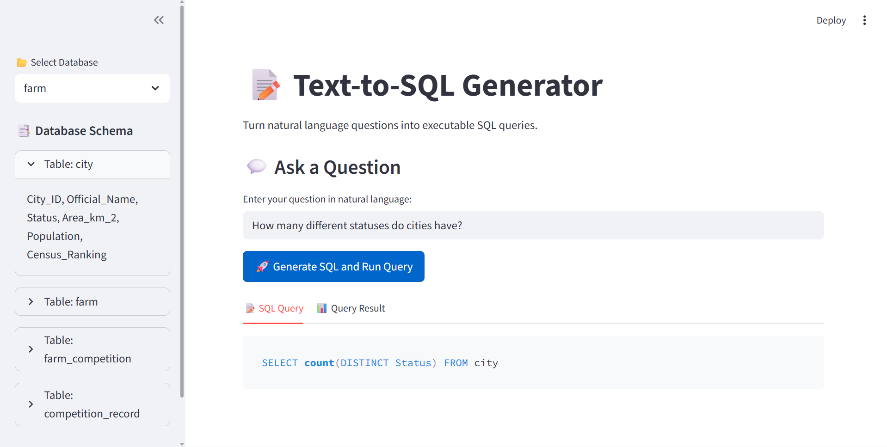

# Text-to-SQL Generator


## Project Overview
This project builds a model that converts natural language questions into SQL queries, enabling non-technical users to query databases easily. The model is fine-tuned on the Spider dataset, a large, complex, cross-domain text-to-SQL dataset.

## Objective
- Enable users to ask questions in plain English.
- Automatically generate accurate SQL queries.
- Test queries on a sample database to validate results.

## Project Structure
- `data/` — Datasets (Spider or smaller test sets)
- `notebooks/` — Experimental notebooks for prototyping
- `src/` — Python modules and functions
- `Dockerfile` — Docker setup
- `requirements.txt` — Python dependencies
- `README.md` — Project documentation
- `.github/` — GitHub issues, workflows, and project boards
- 
## Datasets
For details on the datasets used in this project (including download links and preprocessing instructions), see the [Datasets README](data/README.md).

## Tokenizer & Model
For details on the tokenizer and model used in this project , see the [Tokenizer & Model README](models/README.md).

## 🚀 Demo of the App  

We provide a simple Streamlit frontend to interact with the Text-to-SQL model.  

👉 For the full walkthrough with screenshots, see the [App Demo README](images/README.md).


## Docker Setup

### Build Docker Image
```bash
docker build -t text-to-sql .

```
**Note:** Because of the large size, the model and the pretrained dataset are not included in this repository.

### 2. Prepare Model and Dataset
To get the model and dataset, start the container interactively with the following command:

```bash
docker run -it -v ${PWD}:/app text-to-sql bash
```
Inside the container, run:
```bash

python data.py
python tokenize_dataset.py
python train.py
```

### Run the container
```bash
docker run -it --rm \
    -p 8501:8501 \
    -v ${PWD}:/app \
    text-to-sql \
    streamlit run app.py --server.port=8501 --server.address=0.0.0.0
```
### 3. Open the Streamlit App
Once the container is running, open your web browser and go to:
```bash
http://localhost:8501
```


