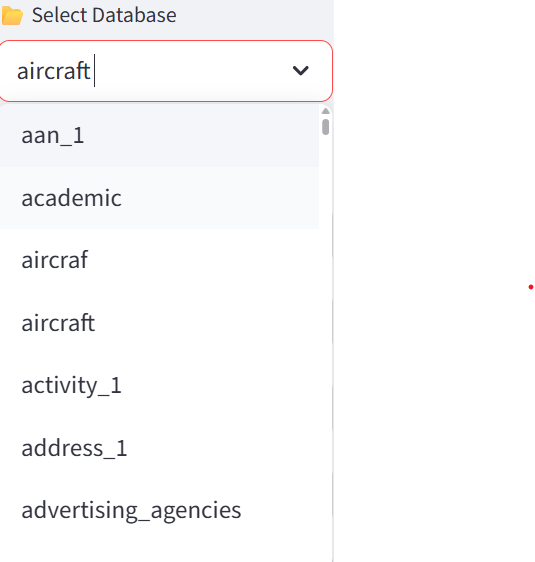
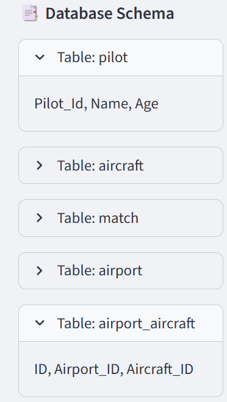
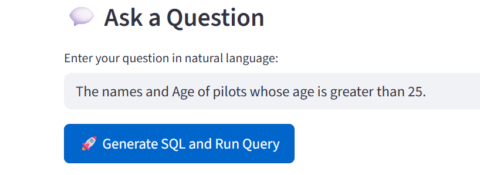
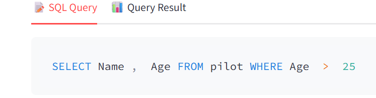
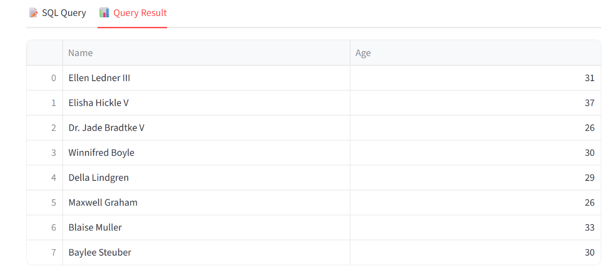

# 🖼️ App Demo – Text-to-SQL Generator

This document walks you through the Streamlit frontend of the Text-to-SQL Generator step by step with screenshots.

---

## 1️⃣ Select a Database

When you launch the app, you first need to **choose a database** from the provided test set.  
This makes it easy to ask natural language questions on real database schemas.  

---

## 2️⃣ View the Database Schema

After selecting a database, the app automatically displays its **tables and columns**.  
This helps you understand the structure before writing your query.  

---

## 3️⃣ Ask a Question in Natural Language

Now you can type any **question in plain English**.  

---

## 4️⃣ Generate the SQL Query

The model translates your natural language question into **SQL**.  
You can review the generated query before running it.  

---

## 5️⃣ Execute and View Results

Finally, the SQL is executed directly on the chosen database.  
The results are displayed in a clean, interactive table.  

---

## ✅ Summary

The app lets you:
- Pick a test database  
- Explore its schema  
- Ask questions in natural language  
- Translate them into SQL  
- Run the query and verify the results instantly  

---
